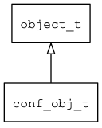

## conf\_obj\_t
### 概述


conf对象。
----------------------------------
### 函数
<p id="conf_obj_t_methods">

| 函数名称 | 说明 | 
| -------- | ------------ | 
| <a href="#conf_obj_t_conf_obj_create">conf\_obj\_create</a> |  |
| <a href="#conf_obj_t_conf_obj_get_doc">conf\_obj\_get\_doc</a> | 获取doc对象，用于更高级的操作。 |
| <a href="#conf_obj_t_conf_obj_save">conf\_obj\_save</a> | 保存文档。 |
#### conf\_obj\_create 函数
-----------------------

* 函数功能：

> <p id="conf_obj_t_conf_obj_create">

* 函数原型：

```
object_t* conf_obj_create (conf_doc_save_t save, conf_doc_load_t load, const char* url, bool_t create_if_not_exist);
```

* 参数说明：

| 参数 | 类型 | 说明 |
| -------- | ----- | --------- |
| 返回值 | object\_t* | 返回配置对象。 |
| save | conf\_doc\_save\_t | 保存函数。 |
| load | conf\_doc\_load\_t | 加载函数。 |
| url | const char* | 路径。 |
| create\_if\_not\_exist | bool\_t | 如果不存在是否创建。 |
#### conf\_obj\_get\_doc 函数
-----------------------

* 函数功能：

> <p id="conf_obj_t_conf_obj_get_doc">获取doc对象，用于更高级的操作。

* 函数原型：

```
conf_dot_t conf_obj_get_doc (object_t* conf);
```

* 参数说明：

| 参数 | 类型 | 说明 |
| -------- | ----- | --------- |
| 返回值 | conf\_dot\_t | 返回doc对象。 |
| conf | object\_t* | conf对象。 |
#### conf\_obj\_save 函数
-----------------------

* 函数功能：

> <p id="conf_obj_t_conf_obj_save">保存文档。

* 函数原型：

```
ret_t conf_obj_save (object_t* conf);
```

* 参数说明：

| 参数 | 类型 | 说明 |
| -------- | ----- | --------- |
| 返回值 | ret\_t | 返回RET\_OK表示成功，否则表示失败 |
| conf | object\_t* | conf对象。 |
